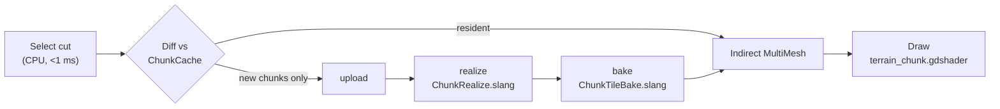

# Architecture

## How we got here

I wanted to give instruments to developers and artists to make more interesting
games.

Work on this project started in early 2024, after reading a paper about
meteorological simulations using an icosphere. The project was more focused on
simulations and less on LOD.

So I started implementing the first version of the icosphere subdivision
algorithm with LOD in GDScript. Building the project was slow, since I used to
compute with pen and paper the positions of each face, the orientations and the
index numbers in order to debug issues. The GDScript — and then the C#,
single-threaded — implementation was recomputing every face every frame, and was
too slow. Given my Python background, I tried to re-implement it in PyTorch using
a client–server approach. The transfer latency was too much, so I rebuilt the
project as an ONNX model and ran it in C# on multiple cores. It was buggy, due to
the limitations of the ONNX exporter, but it was a good local optimum. Still, each
update was taking 300 ms.

I posted some results and met [Tolcrein](https://github.com/Tolcrein) on Reddit.
He wanted to make n-body simulations for his game, and became the first user of
the tool. I thank him for testing CelestialSim since then, and for sharing useful
resources.

Then I found out about [Shader Slang](https://shader-slang.org/). It would let me
run code on the GPU directly in Godot, and would be easier to write than GLSL. It
worked well. My algorithm, though — not Slang — needed a complex cache system that
would reuse, deallocate or allocate GPU buffers based on how the player moved in
the scene. The biggest
remaining issue was
[CPU→GPU readback](https://github.com/godotengine/godot-proposals/issues/7209).
The system at the time needed to draw hundreds of thousands of triangles, for lack
of a good texturing system. This caused visible lag spikes.

I kept iterating in this local minimum, posting on Reddit, and made a standalone
web rendering of subdividing an icosphere using Shader Slang — now hosted at
[compute.toys](https://compute.toys/view/3159) for an easier viewing experience —
featured also at the
[Birds of a Feather at SIGGRAPH 2025](https://youtu.be/Y7uBfTxFnnA?t=287).

Interested by the idea of geometry clipmaps — and by how I could reuse the same
meshes instead of rendering a different one every time, reducing the transfer cost
— I tried to rewrite the algorithm using that approach. A clipmap hierarchy was
used for each face of the icosphere. Testing the approach had always been
difficult, but as LLMs became better I started using them for the project and
translated the whole codebase from C# + Slang to Rust + Slang. In two weeks I had
fewer bugs, comparable speed, and could finally have automatic tests and
verification.

### Other ideas tested, so that you don't have to

**Sharing vertices computed on the GPU between rendering devices** by saving the
positions inside a texture. It works well on Linux and Windows, but not on
Android. Instead, the main rendering device is now used, and to avoid all the work
being done on the same frame (and lagging), the work is split across frames.

**There is a way to actually skip the GPU→CPU readback.** You can set the
positions of MultiMesh instances directly from GPU buffers, so custom geometry can
be generated on the GPU and rendered as a MultiMesh where each mesh is a triangle.

### Chunked LOD

Of all the algorithms tested up to now, the best is **chunked LOD**. First, on the
CPU, a visible-chunks list is computed in less than 1 ms. Then it is sent to the
GPU, where the noise function is applied and the textures are baked. Then we draw
it directly. There is no CPU→GPU readback, and since the chunks are stable we can
cache them (including their textures) and reuse them. So if the player revisits the
same zones, nothing is computed.

This also allows for a CPU path, where we compute the chunks asynchronously and
re-bake them when they are ready, then send them to the GPU — while the GPU cache
shows some low-resolution data in the meantime.

## How it works today

### Select — CPU, every frame

The 20 icosphere faces are the roots of a fixed triangular quadtree; each node
splits 1→4 at its edge midpoints. `celestial_algo::quadtree::select_chunks` walks
that tree and returns the **cut** where a chunk's projected triangle size drops
under the target screen-space error, culling anything fully beyond the horizon on
the way down. The cost scales with the number of chunks in the cut — not with the
number of triangles those chunks will become. It is a sub-millisecond pass.

### Diff and cache

The cut is diffed against the resident set (`ChunkCache`, an LRU over stable pool
slots). Chunks you already have are already realized and already baked; only the
**newly visible** ones generate work. A chunk id is `(face, depth, path)` — no
camera in it — so a slot stays valid for as long as the chunk is resident.

### Realize and bake — GPU

The new chunks are packed into descriptors and handed to a job on the render
thread, which runs the pipeline `upload → realize → bake`.
**`ChunkRealize.slang`** writes each chunk's vertices — the interior grid plus
crack-free skirts along the seams — into a shared vertex pool.
**`ChunkTileBake.slang`** bakes that chunk's colour + world-normal detail atlas.
Both write straight into GPU-resident storage feeding an **indirect MultiMesh**.
Nothing comes back to the CPU.

The whole terrain path is expressed as a small computation graph (`celestial-graph`)
whose nodes re-record only when their inputs are dirty — so a colour-only edit
does not re-run geometry, and an idle camera re-runs nothing.

### Draw

`addons/celestialsim/terrain_chunk.gdshader` samples the vertex pool and the
atlases and applies each instance's **geomorph** blend in the vertex stage, so a
chunk fades into its parent's resolution instead of popping when the LOD changes.

### Amortisation

New-chunk admission is throttled: at most `max_bakes_per_frame` chunks (default
**48**) are realized per frame, so a sudden influx — a fast dive toward the
surface — is spread over several frames instead of landing in one.

## What this buys you

No readback, so no stalls on the main renderer and no lag spikes. Stable cached
chunks, so revisiting terrain is free. Constant CPU selection cost, so the
triangle count you can afford is a decision your GPU makes, not a tax your CPU
pays.

One honest limitation: the **CPU (GDScript) builder path is much slower than the
GPU path** — it bakes chunks on the main thread and does not enjoy any of the
above. Prefer a GPU builder for procedural terrain; see
[the `Celestial` node](celestial-node.md) for the performance guidance, and
[builders](builders.md) for the async escape hatch if you need CPU-side data.

## Credits & further reading

- **[Tolcrein](https://github.com/Tolcrein)** — first user and tester.
- The **Shader Slang** team, who showed the GPU-subdivision demo at their
  SIGGRAPH 2025 Birds of a Feather session.
- The standalone web demo: [compute.toys/view/3159](https://compute.toys/view/3159).
- Project page: [celestialsim.github.io](https://celestialsim.github.io/) —
  come say hi on [Discord](https://discord.gg/bfCcWkstRB).
