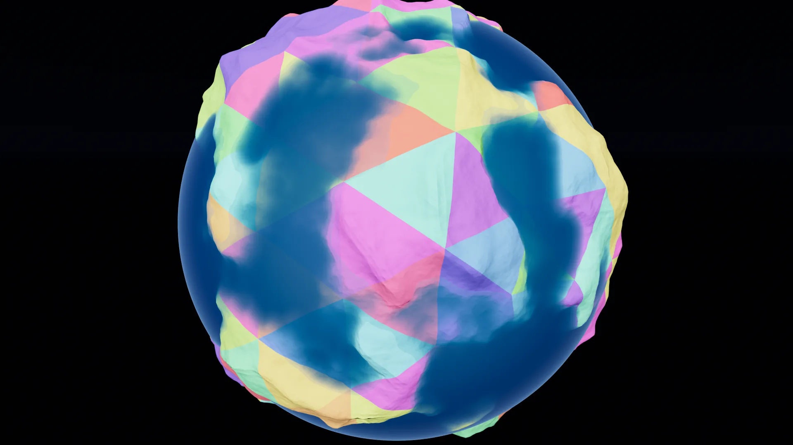

# The `Celestial` node

`Celestial` is the planet: a `Node3D` you drop in a scene, give a radius and a
[builder](builders.md), and it renders an adaptive-LOD spherical terrain. Every
frame it picks the chunks the camera can actually see and realizes the new ones
on the GPU — see [architecture.md](architecture.md) if you want to know how.



*`lod_colors = true` tints each chunk by its LOD level, which is the fastest way to
see the cut the CPU selected: fine near the camera, coarse toward the limb.*


This page is about the knobs on the node: what they do, what they cost, and how
to read the numbers back out.

## Properties

| Property | Default | Range | What it does |
|---|---|---|---|
| `radius` | `1000.0` | — | Sphere radius in world units, before terrain displacement. |
| `screen_error` | `0.02` | 0.005–0.5 | LOD threshold: a chunk splits while its projected edge exceeds this fraction of the screen. |
| `chunk_res` | `16` | 2–32 | Grid segments per chunk edge — `chunk_res²` triangles per drawn chunk. |
| `tile_res` | `32` | 8–1024 | Resolution of each chunk's baked colour + normal detail tile. |
| `max_depth` | `16` | 0–20 | Deepest quadtree level. `0` = the 20 base icosphere faces, nothing else. |
| `vram_budget_gib` | `1.0` | 0.05–8.0 | VRAM ceiling for the resident-chunk pools. Slot count is derived from it. |
| `geomorph` | `true` | — | Blend each chunk between its own and its parent's grid across an LOD band, so detail fades instead of popping. |
| `horizon_cull` | `true` | — | Drop chunks fully beyond the planet's horizon. |
| `cull_height_margin` | `0.3` | 0–1 | Terrain slack for that cull, as a fraction of `radius`. Raise it if tall terrain pops in at the horizon. |
| `max_bakes_per_frame` | `48` | 1–4096 | Cap on newly-visible chunks realized+baked in one frame. |
| `recompute_every_frame` | `false` | — | Bypass the cache and re-realize every visible chunk each frame. A measurement tool, not a shipping setting. |
| `lod_colors` | `false` | — | Tint chunks by pool slot so the chunk tiling is visible. |
| `debug_log` | `true` | — | Print the plugin's log lines. |
| `builder` | a `CesGPUNoiseExample` | — | The terrain source. Clear it and you get a plain white sphere. |
| `scatter_layers` | empty | — | `Array[CesScatterLayer]` — grass, trees, rocks. See [scatter.md](scatter.md). |

A fresh `Celestial` gives itself a `CesGPUNoiseExample` builder the first time it
enters the tree, so you never start at a blank sphere. Clearing the slot
afterwards is respected — it won't be re-added.

!!! note
    The **water** is configured on the *builder*, not on this node. Look for
    `water_enabled` / `water_height` under the Builder resource. See
    [water.md](water.md).

## Performance

### Turn V-Sync off before you measure anything

Project Settings → Display → Window → **V-Sync Mode = Disabled**. With V-Sync on,
the framerate is pinned to your monitor and the numbers tell you nothing: a
setting that costs 2 ms and one that costs 12 ms both read as 60 fps, right up
until the point where the plugin suddenly looks slow. Every claim below is about
frame *time*, which you can only see with the cap off.

### The cost knobs

- **`screen_error`** — the master dial. It sets how much geometric error you
  tolerate on screen, so it decides how many chunks are in the cut, which decides
  how much realizing, baking, and drawing happens. Lower = sharper terrain, more
  chunks, more bakes, more VRAM pressure. This is the first thing to move, in
  either direction. (The committed example scene runs `0.05`, looser than the
  `0.02` default.)
- **`tile_res`** — surface (colour + normal) detail per chunk, independent of the
  geometry grid. It is the main VRAM driver: each resident chunk costs
  `tile_res² × 16 B` of atlas on top of its geometry, so raising `tile_res` from
  64 to 256 is a 16× increase in per-chunk texture cost and shrinks how many
  chunks fit in `vram_budget_gib`. It also dominates bake time, and on a CPU
  builder it is the size of the array you have to fill per chunk.
- **`chunk_res`** — triangles per chunk (`chunk_res²`). Cheap compared to
  `tile_res`, but it multiplies the drawn triangle count directly.
- **`max_depth`** — the floor under `screen_error`. Lowering it caps how fine
  terrain can ever get (and how close you can stand to it before it looks flat);
  it does not otherwise change per-frame cost.
- **`vram_budget_gib`** — the residency ceiling. Slots = budget ÷ per-chunk
  bytes. Too small and chunks are evicted and re-baked as you turn around; too
  large and you are simply reserving VRAM you don't need. `resident_count()` vs
  `effective_budget()` tells you which side you're on.
- **`max_bakes_per_frame`** — spike control. Teleporting, or whipping the camera
  around, makes hundreds of chunks newly visible at once; this caps how many get
  realized and baked in a single frame and lets the rest arrive over the next
  few. Lower it if you see a hitch on fast camera moves; raise it if terrain
  visibly fills in too slowly.
- **`geomorph`** — smooth LOD transitions. It costs a per-frame instance-buffer
  upload while the camera moves (the cached geometry is untouched). Turning it
  off removes that upload and reintroduces popping.
- **`horizon_cull`** — leave it on. It removes the far hemisphere, and near the
  ground the horizon is close, so it also drops distant chunks you can't see.

### GPU builders are much faster than CPU builders

A GPU builder (the built-in noise, or your own `.glsl`) evaluates terrain on
thousands of GPU threads with essentially no CPU cost. A **GDScript CPU builder
bakes on the main thread, one call per chunk** — the loop is real GDScript, so at
a high `tile_res` it will stall frames. If you need CPU-side terrain:

- Prefer the **async bake API** (`_bake_requested` + `submit_chunk`, see
  [custom_terrain_cpu_gdscript.md](custom_terrain_cpu_gdscript.md#advanced-async-bake-threads-files-network)).
  The planet hands you chunks and never waits; a chunk without a surface yet is
  covered by a coarser ancestor. A slow bake then costs detail, not framerate.
- For real throughput, write your **own Rust GDExtension builder** — you get
  threads, no GDScript interpreter, and no per-chunk marshalling.

This section is a sketch; the documentation will be expanded with proper
measurements and numbers in a future release.

## Reading the numbers back out

`Celestial` exposes its own stats to GDScript, which is how the example scene's
HUD is built (`scenes/celestial_v5.tscn`, driven by
`scripts/quadtree_chunks.gd`):

| Method | Returns |
|---|---|
| `triangle_count()` | Triangles currently drawn (visible chunks × `chunk_res²`). |
| `resident_count()` | Chunks held in the GPU cache. |
| `effective_budget()` | Slots the VRAM budget actually affords. |
| `realize_count()` | Chunks realized in the last staged batch — `0` once the camera settles. |
| `chunks_in_queue()` | Chunks still streaming toward full detail. `0` = everything in view has arrived. |
| `select_ms()` | CPU time of the last quadtree selection. |
| `update_ms()` | CPU time of the last cache update. |
| `pool_vram_bytes()` | VRAM reserved by the chunk pools. |
| `gpu_report()` | Per-stage GPU time of the last realize job, e.g. `"upload 0.01 + realize 0.42 ms"`, or `"idle"`. |
| `cut_report()` | Per-depth histogram of the selected cut vs what was drawn — a gap means chunks are missing on screen. |

```gdscript
@onready var planet: Celestial = $Celestial

func _process(_d: float) -> void:
    $HUD.text = "tris %d   resident %d/%d   realize %d\n%s" % [
        planet.triangle_count(),
        planet.resident_count(), planet.effective_budget(),
        planet.realize_count(),
        planet.gpu_report(),
    ]
```

For debugging *shape* rather than speed, `lod_colors` makes the chunk tiling
visible (useful for seeing where LOD is spending its budget) and `debug_log`
prints the plugin's own log lines.

## Putting an object on the surface

The ground is not at `radius` — terrain displaces it, and on a mountain that can
be a long way out. `ground_radius_at(dir)` gives you the rendered ground radius
along a unit direction from the planet centre:

```gdscript
func place_on_surface(node: Node3D, dir: Vector3, altitude: float = 0.0) -> void:
    var d := dir.normalized()
    node.global_position = planet.global_position \
        + d * (planet.ground_radius_at(d) + altitude)
    node.look_at(node.global_position + d.cross(Vector3.UP), d)  # up = radial
```

!!! warning
    `ground_radius_at` is answered by the **CPU surface provider**, so it returns
    a real displaced radius only on a CPU builder route (`CesCPUNoiseExample`, or
    your own GDScript builder). On a GPU builder there is no CPU-side height
    field to sample and it returns the bare `radius`.
