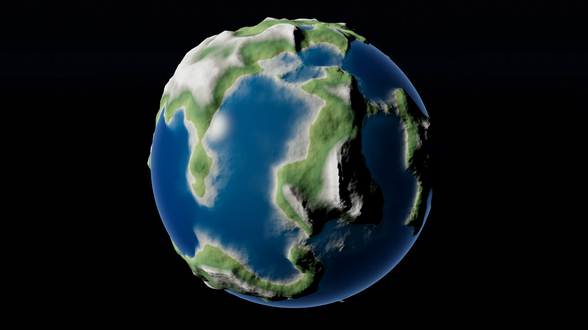

# Getting started

From an empty scene to a planet on screen. This page assumes the addon is already
[installed](install.md).

## Your first planet

1. Create (or open) a **3D scene**.
2. Select the root node → **Add Child Node** → search for **`Celestial`** → add it.
3. Add a **`Camera3D`** to the scene and set its **Transform → Position** to
   `(0, 0, 2500)`.
4. Press **Play**.

You should see a full globe with terrain on it. The default `radius` is **1000**, so a
camera around **2500** units from the origin frames the whole planet; move in to ~1100 to
sit just above the surface. A camera *inside* the radius starts you underground, which is
the usual reason a first run looks like a black screen.



*A stock `Celestial` node, framed from 2500 units out. This is what a first run looks
like — no builder to assign, no material to set up.*


A new `Celestial` node auto-assigns a **`CesGPUNoiseExample`** builder, so it is never
blank out of the box. Clearing the `builder` slot renders a plain white sphere.

!!! note "Fly around a finished scene"
    The repository ships `scenes/celestial_v5.tscn` — a navigable planet with a freefly
    camera and a stats HUD. Open it and fly down to the surface to watch the LOD work.
    `scenes/celestial_gpu_noise.tscn`, `scenes/celestial_cpu_noise.tscn` and
    `scenes/earth_size_planet.tscn` are smaller examples.

## From code

`Celestial` is a plain `Node3D`, so you can spawn one like any other node:

```gdscript
extends Node3D

func _ready() -> void:
    var planet := Celestial.new()
    planet.radius = 1000.0
    planet.screen_error = 0.02
    planet.tile_res = 64
    add_child(planet)
```

Properties set before `add_child` are picked up on the first frame, and changing them
later updates the planet live.

## The knobs that matter first

| Property | Default | What it does |
|----------|---------|--------------|
| `radius` | `1000.0` | The planet's size in world units. Everything else is relative to it — scale your camera speed and near/far planes with it. |
| `screen_error` | `0.02` | Detail vs. cost. **Lower = sharper terrain and more chunks** (so more GPU work); higher = coarser and cheaper. Range `0.005`–`0.5`. |
| `tile_res` | `32` | Resolution of the colour + normal texture baked per chunk. Raise it (`64`, `128`) for crisper surface detail, at the cost of VRAM and bake time. Range `8`–`1024`. |
| `max_bakes_per_frame` | `48` | How many newly-visible chunks may be realized and baked in a single frame. Lower it to smooth bake spikes after a teleport or a fast dive; raise it to fill in detail faster. |
| `lod_colors` | `false` | Debug: tints chunks so you can see the LOD tiling and where splits happen. Turn it on when `screen_error` isn't behaving as you expect. |

There are more (`chunk_res`, `max_depth`, `vram_budget_gib`, `geomorph`, `horizon_cull`,
…) — the [`Celestial` node reference](celestial-node.md) has the full list.

## Turn off V-Sync before you judge performance

V-Sync caps the framerate at your monitor's refresh rate, which hides the real cost of a
setting. Before you measure anything, go to **Project Settings → Display → Window →
V-Sync Mode** and set it to **Disabled**. Put it back when you're done.

## Where next

- **[Make your own terrain](builders.md)** — swap the default noise for a `.glsl` shader
  or a GDScript builder.
- **[Add an ocean](water.md)** — water is configured on the *builder*, not on the planet.
- **[Scatter objects](scatter.md)** — GPU-placed grass, trees and rocks via `scatter_layers`.
- **[How it works](architecture.md)** — the quadtree cut, the GPU graph, and why there is
  no readback.
