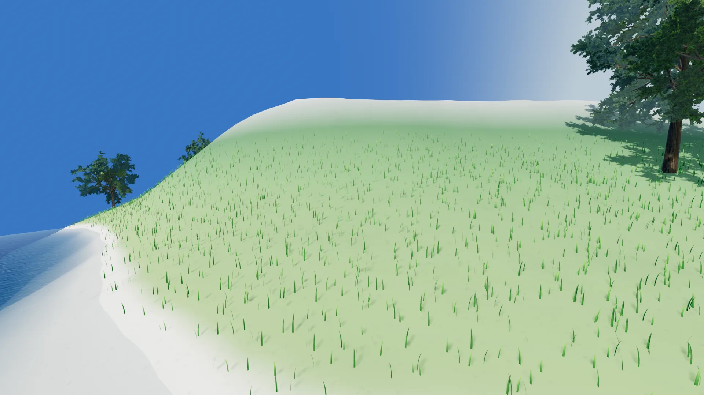

# CelestialSim

**GPU-realized procedural planets for Godot.** Add one `Celestial` node to a 3D scene and
you get a planet with adaptive chunked-quadtree LOD — geometry and surface detail are
realized on the GPU, with no readback and no lag spikes.

<video poster="assets/hero.webp"
       autoplay muted loop playsinline preload="auto"
       style="width:100%;border-radius:8px;margin:1em 0;">
  <source src="assets/descent.mp4" type="video/mp4">
  
</video>
*Orbit to surface in one continuous dive — the terrain refines as the camera falls,
and nothing is read back from the GPU.*

!!! info "Beta"
    CelestialSim is in beta: ready to build with, but still pre-1.0, so APIs can change
    between releases. If something is missing or unclear, tell us on
    [Discord](https://discord.gg/bfCcWkstRB) or
    [GitHub](https://github.com/CelestialSim/CelestialSim/issues).

## Start here

### I want a planet in my scene

Install the addon, drop in a node, press play. No Rust required.

- [Install](install.md) — download the release zip, copy one folder, done.
- [Getting Started](getting-started.md) — your first planet, from the editor and from
  GDScript, plus the handful of knobs worth touching first.

### I want my own terrain

The built-in noise is a starting point, not the product. Bring your own height and colour
functions.

- [Terrain builders](builders.md) — how the `builder` property works and which path to
  pick.
- [Custom GPU terrain](custom_terrain_gpu.md) — write a `.glsl` with two small functions.
- [Custom CPU terrain in GDScript](custom_terrain_cpu_gdscript.md) — batched GDScript,
  including an async bake off the main thread.

### I want to know how it works

- [Architecture](architecture.md) — the screen-space-error quadtree cut, the chunk cache,
  and the `upload → realize → bake` GPU graph.

## Reference

- [`Celestial` node](celestial-node.md) — every export, with its range and default.
- [Water](water.md) — the analytic ocean, configured on the builder.
- [Scatter objects](scatter.md) — GPU-placed grass, trees and rocks.
- [Rust API reference](api/celestialsim/index.html) — generated from `cargo doc`.
