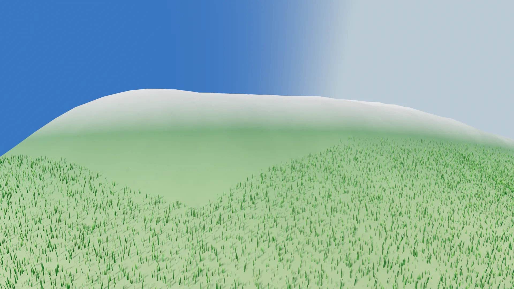

# Scatter objects (grass, trees, rocks)

A **scatter layer** takes one mesh and spreads it over the planet's surface. The
`Celestial` node has a `scatter_layers` array; each entry is a
`CesScatterLayer` resource. Add a layer, give it a mesh, and it appears on the
terrain — placed, culled and drawn entirely on the GPU, with no readback and no
per-instance CPU work.




The two things worth knowing before you touch a slider:

- **Instances are keyed to a stable world lattice**, not to the terrain chunk
  that happens to host them. A blade of grass is identified by
  `(face, lattice cell, index, seed)`, so when a chunk splits or merges as you
  walk toward it, nothing moves, re-rolls, or swims. Placement is reproducible
  from the seed alone.
- **A layer with no mesh is inactive.** It renders nothing. That is the intended
  way to park a layer, and it means an empty layer array is not a bug.

## Properties

| Property | Default | Range | What it does |
|---|---|---|---|
| `layer_name` | `""` | — | Display name. Mirrored into `resource_name`, so the inspector array shows "Grass" instead of "CesScatterLayer". |
| `enabled` | `true` | — | LIVE on/off. A disabled layer keeps its GPU placement, so re-enabling is instant. |
| `mesh` | none | — | The instanced mesh. **No mesh = inactive layer.** |
| `density` | `0.5` | 0–1 | LIVE. Fraction of lattice candidates actually drawn. |
| `scale` | `1.0` | 0.01–100 | Base scale, on top of a ±20% per-instance jitter. |
| `min_height` | `0.45` | 0–1 | LIVE. Lowest normalized terrain height this layer may appear on. |
| `max_height` | `1.0` | 0–1 | LIVE. Highest. Lower it to keep vegetation off the peaks. |
| `lod_level` | `9` | 0–20 | Fineness of the lattice — the density *and* reach knob (below). |
| `instances_per_cell` | `4` | 1–64 | Candidates generated per lattice cell (K). |
| `max_instances` | `100000` | 64–4,000,000 | Cap on the layer's MultiMesh. The compact pass clamps to it. |
| `seed` | `0` | — | Placement seed. Same seed + same lattice = same transforms. |

## `lod_level`: density and view distance are the same knob

`lod_level` sets how finely the world lattice is subdivided. Raise it and the
cells get smaller, so you get **more instances, packed closer together** — but a
fine lattice only fits on terrain chunks that are themselves fine enough to hold
it, so the layer stops appearing on distant, coarse terrain. Lower it and the
lattice gets coarse: **fewer, more spread-out instances, visible from much
further away.**

In practice: raise `lod_level` for dense close-up grass, lower it for sparse
vegetation you want to see from a distance. Trees want a lower `lod_level` than
grass. Use `instances_per_cell` to thicken a layer without changing its reach,
and `density` to thin it out live.

The rule underneath is that a layer only appears on terrain chunks at depth
`>= lod_level - 3`, which gives a view distance of roughly:

```
reach ≈ face_edge / (2^(lod_level - 3) · chunk_res · screen_error)   metres
```

where `face_edge`, `chunk_res` and `screen_error` come from the planet. If a
layer refuses to show up at all, `lod_level` is too high for the terrain detail
the planet is currently selecting — lower it, or lower the planet's
`screen_error`.

## Height gates

`min_height` / `max_height` gate on **normalized terrain height, 0–1** — the same
scale as the builder's [`water_height`](water.md).

!!! warning "Set `min_height` yourself, or your grass grows underwater"
    `min_height` defaults to `0.45`, which is *below* the default sea level of
    `0.549` — a layer left at the default will place instances on the seabed. Set
    it at or just above your builder's `water_height` for a clean shoreline. The
    committed example scene uses `0.55` for grass and `0.57` for the oaks. Drop it
    to `0.0` only if you actually want seabed scatter.

Use `max_height` the same way at the top end to keep vegetation off the peaks —
the example scene caps grass at `0.7` and the oaks at `0.67`.

## Which edits are cheap

| Edit | Cost |
|---|---|
| `enabled`, `density`, `min_height`, `max_height` | **Live.** Only the compact dispatch re-runs — no re-placement, no bake, no cache invalidation. Safe to drive from a UI slider. |
| `lod_level`, `seed`, `scale` | Re-places every resident chunk (GPU-only, but every chunk). |
| Adding/removing a layer, `instances_per_cell`, `max_instances` | Rebuilds the GPU job. |

## Grass

Assign the committed blade mesh:

```gdscript
var grass := CesScatterLayer.new()
grass.layer_name = "Grass"
grass.mesh = load("res://addons/celestialsim/grass_blade.tres")
grass.lod_level = 6
grass.instances_per_cell = 64
grass.density = 1.0
grass.min_height = 0.55       # at/above the builder's water_height (0.549)
grass.max_height = 0.7        # a grassy band, not on the peaks
grass.scale = 0.95
$Celestial.scatter_layers.append(grass)
```

`CesScatterLayer.make_grass_blade_mesh()` is the static function that generated
that `.tres`, if you'd rather build it at runtime or use it as a starting point.

For variety, add a second grass layer with a different mesh, `scale`, and — this
is the important part — a **different `seed`**, so the two lattices don't land on
top of each other.

## Trees (and any multi-material object)

A tree is usually two meshes — branches and leaves — because it needs two
materials. Bring your own (any `Mesh` works) and give the two layers the **same
`lod_level`, the same `seed`, and the same `instances_per_cell`**. They then share
one lattice, so the branches and the leaves are placed on exactly the same
transforms: one tree, two meshes, two materials.

!!! note "No tree meshes ship with the addon"
    CelestialSim ships exactly one mesh, the grass blade. The oak below is the
    example from this repository's own scenes (`assets/trees/`) — point the `mesh`
    at whatever tree you have.

```gdscript
for part in ["branches", "leaves"]:
    var layer := CesScatterLayer.new()
    layer.layer_name = "Oak %s" % part
    layer.mesh = load("res://assets/trees/oak_medium_%s.res" % part)  # your mesh
    layer.lod_level = 4           # coarse lattice: sparse, visible from far
    layer.instances_per_cell = 2
    layer.seed = 11               # SAME seed + lattice ⇒ same transforms
    layer.scale = 0.5
    layer.min_height = 0.57
    layer.max_height = 0.67
    $Celestial.scatter_layers.append(layer)
```

Anything that would be one object with several materials — a rock with moss, a
tree with a billboarded canopy — is built this way.

## Notes and limits

- The mesh's material is whatever you put on it; scatter does not supply one.
  Grass usually wants a double-sided, vertex-colour material (the shipped blade
  has one).
- `max_instances` is a hard cap on what a layer can draw. If a layer visibly
  thins out when you look across a valley, you are hitting it — raise it, lower
  `instances_per_cell`, or lower `density`.
- Placement reads the terrain height the GPU already baked, so scatter follows a
  custom builder's terrain automatically. It does not read your builder's
  `color`, so it can't (yet) mask by biome.
- There is no collision. Scatter instances are drawn geometry only.
