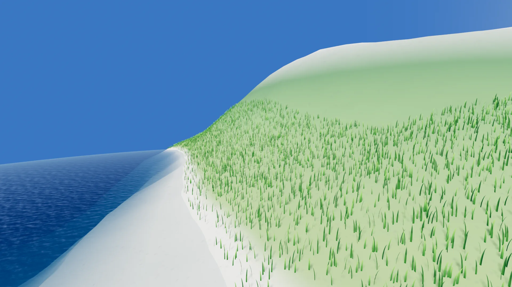

# Water

Every planet can have an ocean. It costs no geometry: there is no water mesh, no
tessellated sea surface, no extra chunks. A coarse proxy sphere spawns fragments
and the shader ray-intersects the *mathematical* sea-level sphere per pixel, so
the surface is perfectly smooth at any distance — from orbit down to standing in
the surf.




!!! note
    **Water lives on the [builder](builders.md), not on the `Celestial` node.**
    If you go looking for a `water_enabled` checkbox on the planet you won't find
    it — open the **Builder** resource in the inspector. The reason is that the
    water level *is* a terrain parameter: it decides the land/sea split and the
    shore colouring the terrain itself is baked with, so it has to travel with the
    terrain. Clear the builder and the water goes with it.

## Properties (on `CesBuilder`, inherited by every builder)

| Property | Default | What it does |
|---|---|---|
| `water_enabled` | `true` | Draw the ocean. Off also hides the appearance knobs below in the inspector (their values are kept). |
| `water_height` | `0.549` | **Sea level** as a normalized terrain height, 0–1. |
| `water_deep_color` | `(0.05, 0.22, 0.42)` | Body colour far from shore. |
| `water_shallow_color` | `(0.20, 0.55, 0.70)` | Body colour near shore. The two are blended by water depth, exponentially. |
| `water_wave_strength` | `0.55` | How strongly the wave normal map perturbs the surface. `0` = a flat mirror. |
| `water_wave_scale` | `0.15` | Wave tiling frequency. |
| `water_wave_speed` | `0.04` | Wave scroll speed. |
| `water_underwater_color` | `(0.04, 0.16, 0.28)` | Fog tint applied when the camera is below the surface. |
| `water_underwater_density` | `0.02` | Beer–Lambert fog density, per world unit of water column. |

## Heights are normalized: what `0.549` means

Terrain height is a number `h` from **0 to 1**, not a radius and not metres.
`0.5` is the baseline — sea-level-ish, the middle of the range. Everything, the
water level included, is expressed on that scale.

Two knobs turn `h` into world units:

```
displaced_radius = radius * (1 + (h - 0.5) * 2.4 * height_scale)
```

- **`height_scale`** is how tall the terrain is, as a fraction of the radius. The
  whole 0→1 height range spans `2.4 × height_scale × radius`. With the GPU noise
  builder's default (`0.0585`) on a 1000-unit planet, that is a **140-unit band**
  for every mountain and trench to live in. Set it to `0` and you get a perfect
  sphere; double it and every mountain doubles. It is the master relief knob.
- **`water_height`** is simply where in that band you fill with water. Put the
  same `h` into the formula and you get the sea-level radius:

```
water_radius = radius * (1 + (water_height - 0.5) * 2.4 * height_scale)
```

At the defaults (`water_height = 0.549`, `height_scale = 0.0585`, radius 1000) the
sea sits at a radius of about **1007** — a little above the baseline, which is why
the stock planet has oceans with continents poking out. Lower `water_height` to
drain them and expose more land; raise it to flood.

Because `height_scale` is in the formula, the same `water_height` means a different
radius on a different builder: the CPU noise example uses `height_scale = 0.25`, so
its terrain — and its sea — sit much further out.

!!! warning
    Editing `water_height` **reshades the whole planet**, not just the sphere:
    the terrain's own shore colouring is baked against it. It is a live edit — you
    see it immediately — but it is not free like a colour tweak, so don't drive it
    from `_process`.

Custom GPU builders can read the same value in their `.glsl` as
`CELS_WATER_HEIGHT`, which is how you keep your shader's own beach line in
agreement with where the water actually is. See
[custom_terrain_gpu.md](custom_terrain_gpu.md#globals-you-can-read).

## How it is rendered

`addons/celestialsim/water_surface.gdshader`, on a low-segment `SphereMesh` proxy
inflated 2% past the true sea-level sphere so its faceted silhouette always
over-covers the smooth one (rays that miss the analytic sphere are discarded).
The shader renders back faces only and occludes manually against the depth
texture of the already-drawn terrain, which is also where water *depth* — and
therefore the shallow-to-deep colour blend and the shoreline foam — comes from.
On top of that: triplanar wave normals, a Schlick fresnel rim reflecting an
analytic sky gradient, and a sun glint taken from the scene's
`DirectionalLight3D`. Below the surface, a Beer–Lambert fog tints everything by
how much water the camera is looking through.

The ocean shading is a port of Sebastian Lague's MIT-licensed planetary ocean;
the provenance is spelled out at the top of the shader file.

## Turning it off

Uncheck `water_enabled` on the builder. The proxy sphere is not drawn at all and
the appearance knobs disappear from the inspector until you turn it back on. The
terrain still uses `water_height` for its land/sea colouring, so an "airless"
planet usually wants `water_enabled = false` *and* a custom `terrain_color` that
doesn't paint a seabed.

!!! note
    On mobile the water's depth-texture read and overdraw are the expensive part
    of the frame — if you are chasing 60 fps on a phone, this is the first thing
    to switch off and measure.
